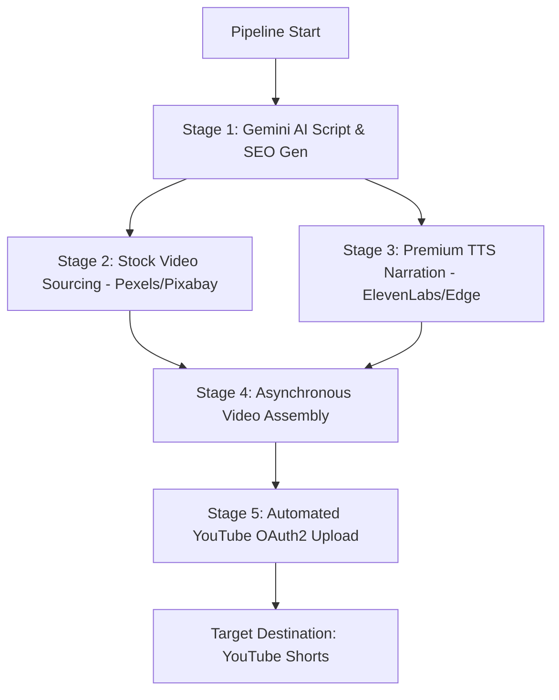

# 🎬 Shadowvault AI Studio

> An enterprise-grade, fully automated, asynchronous video production and distribution pipeline. Built with Python, powered by Gemini Generative AI, MoviePy composition, and premium Text-to-Speech integrations including **ElevenLabs** and **Edge-TTS**.

---

## 🚀 Key Features

- **Asynchronous Pipeline Orchestration**: Leverages Python's `asyncio` to run intensive stages (data fetching, TTS, and upload workflows) concurrently.
- **Dynamic AI Content Architect**: Integrated with **Gemini AI** to autonomously generate high-engagement scripts, titles, and contextual media-search keywords based on content niches.
- **Multi-Provider Speech Synthesis Engine**:
  - 💎 **ElevenLabs API Integration**: Modern, highly realistic voice generation via high-performance async REST requests using `aiohttp`.
  - ⚡ **Edge-TTS**: Lightning-fast, lightweight fallback engine for standard voice narration.
- **Media Asset Sourcing**: Automated asset acquisition pipelines linking into Pexels and Pixabay APIs for high-resolution vertical footage matching the AI-generated context.
- **Robust Video Composition Engine**: Automatically handles vertical (9:16) scaling, video-audio synchronization, dynamic trailing, and audio layering using MoviePy.
- **Autonomous Distribution Pipeline**: Seamless OAuth2 integration with the YouTube Data API v3 for automated video uploading, scheduling, and metadata syncing.
- **Configurability**: Fully driven by secure environment variables (`.env`) with a type-safe, frozen configuration layer.

---

## 🛠️ System Architecture



---

## 📦 Installation & Setup

### 1. Prerequisites
- **Python**: version 3.9 or higher
- **FFmpeg**: Required on the system PATH for media encoding/decoding

### 2. Install Project in Editable Mode
Clone the repository and install the development dependencies:
```bash
pip install -e .
```

### 3. Configure the Environment
Create a `.env` file in the project root:
```env
# === Required API Keys ===
GEMINI_API_KEY=your-gemini-api-key-here
PEXELS_API_KEY=your-pexels-api-key-here

# === Optional API Keys ===
PIXABAY_API_KEY=your-pixabay-api-key-here

# === TTS Settings ===
TTS_PROVIDER=elevenlabs                 # "elevenlabs" or "edge"
ELEVENLABS_API_KEY=your-elevenlabs-key
ELEVENLABS_VOICE_ID=pNInz6obpgq5paNsJ7vm

# Fallback Edge-TTS Configuration
TTS_VOICE=en-US-ChristopherNeural
TTS_RATE=-6%
TTS_PITCH=-5Hz

# === Gemini Settings ===
GEMINI_MODEL=gemini-2.0-flash

# === Video Specifications ===
OUTPUT_WIDTH=1080
OUTPUT_HEIGHT=1920
FPS=24
CODEC=libx264
AUDIO_CODEC=aac
PRESET=ultrafast
BG_MUSIC_VOLUME=0.12
TRAIL_SECONDS=1.5

# === Paths ===
MUSIC_FOLDER=music
OUTPUT_FOLDER=output
TEMP_DIR=temp
LOG_DIR=logs
ARCHIVE_FOLDER=uploaded_archive

# === YouTube OAuth2 Credentials ===
CLIENT_SECRETS_FILE=client_secrets.json
TOKEN_PICKLE_FILE=token.pickle

# === Automation Loop Settings ===
MAX_VIDEOS_PER_DAY=5
INTER_VIDEO_DELAY_MIN=14400
INTER_VIDEO_DELAY_MAX=21600
```

### 4. YouTube OAuth Authentication
Place your `client_secrets.json` (downloaded from Google Cloud Console under YouTube Data API v3 OAuth credentials) into the root folder. On first run, a secure browser window will open to authenticate the session, saving a persistent session token to `token.pickle`.

---

## 🕹️ CLI Usage & Operations

Shadowvault comes with a pre-configured CLI script mapping.

### Standard Execution (Single Run)
```bash
shadowvault --mode once --niche horror
```

### Dry Run (Render only, skip YouTube distribution)
```bash
shadowvault --mode once --niche horror --no-upload
```

### Fully Autonomous Loop (Continuous Pipeline)
Runs an infinite orchestration loop with parameterized daily caps and randomized inter-video publication delays to maintain a human-like schedule:
```bash
shadowvault --mode loop --niche motivation --privacy unlisted
```

### CLI Command Options

| Option | Valid Values | Default | Description |
| :--- | :--- | :--- | :--- |
| `--mode` | `once`, `loop` | `once` | Single automated render/upload or persistent automation loop. |
| `--niche` | `horror`, `motivation`, `facts` | `horror` | Target content category for AI generation. |
| `--length` | `short`, `long` | `short` | Desired output length of video. |
| `--privacy` | `public`, `unlisted`, `private` | `public` | Default privacy standard on YouTube upload. |
| `--no-upload` | *Flag* | — | Prevents pipeline from executing the YouTube API Stage. |

---

## 📁 Repository Structure

```
├── shadowvault/
│   ├── __init__.py
│   ├── pipeline.py          # Pipeline orchestration, async scheduling, CLI entry
│   ├── config.py            # Strongly-typed environment configuration layer
│   ├── models.py            # Pipeline run models and validation dataclasses
│   ├── content.py           # Stage 1: Gemini AI Script & SEO optimization
│   ├── media.py             # Stage 2: Stock assets crawling via Pexels/Pixabay APIs
│   ├── audio.py             # Stage 3: Premium ElevenLabs & Edge-TTS sound engine
│   ├── video.py             # Stage 4: MoviePy video compilation & composition
│   ├── upload.py            # Stage 5: YouTube API v3 distribution client
│   ├── logging_config.py    # Standardized system-wide logging
│   └── utils/
│       └── file_manager.py  # Automated garbage-cleanup of temporary assets
├── pyproject.toml           # Package manifests and dependency declarations
├── .env.example             # Documented template for environmental tokens
└── README.md                # Technical system documentation
```

---

## 🧪 Development & Testing

Run unit tests via `pytest` to verify the pipeline stages:
```bash
pytest
```
