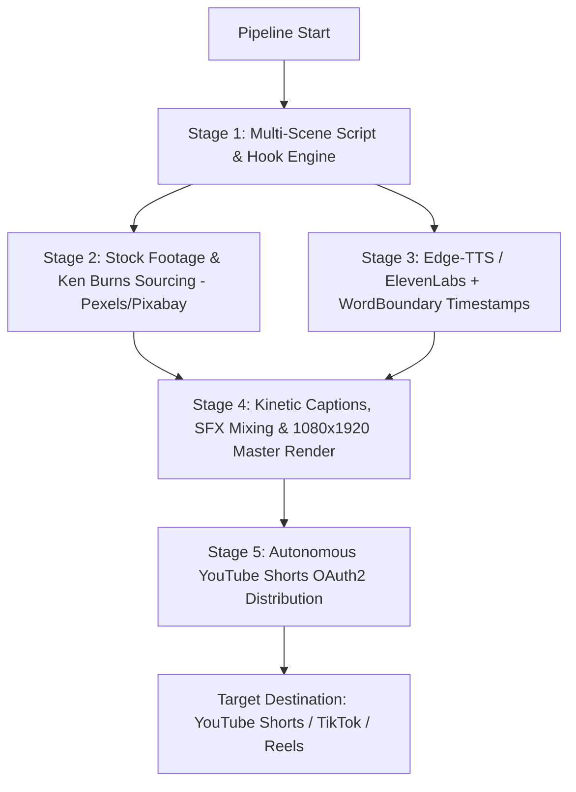

# 🎬 Faceless Video Engine (Next-Gen AI Shorts Studio)

> An automated, studio-grade vertical video production pipeline designed for **YouTube Shorts, TikTok, and Instagram Reels**. Engineered to stand out from low-effort AI slop with **multi-scene B-roll editing, Ken Burns camera dynamics, millisecond-accurate word-by-word kinetic captions (MrBeast / Hormozi style), and dynamic sound design (SFX)**.

---

## ⚡ Why This Stands Out (AI Slop vs Studio Quality)

| Feature | Generic AI Slop (0 views) | This Faceless Video Engine (Viral Retention) |
| :--- | :--- | :--- |
| **Hook (0-2s)** | *"Did you know that in 1990..."* | **In-Media-Res Pattern Interrupt**: *"He stole $100M with a $2 can of hairspray."* |
| **Visuals & Pacing** | 60s of the same looped Minecraft or GTA ramp | **5–8 dynamic scene cuts** (every 3–5s) with smooth Ken Burns zoom & pan |
| **Subtitles** | Unsynced plain text block at the bottom | **Word-by-word glowing kinetic subtitles** (#FFE500 neon yellow pop + contextual emojis) |
| **Sound & SFX** | Monotonous robot without effects | **Natural Neural Voice** + transition whooshes, sub-bass impacts, and auto-ducked music |
| **Niches** | Oversaturated generic reddit gossip | **High-converting niches**: Heists & Scams, Glitches in History, Business Rivalries, Dark Psychology |

---

## 🛠️ System Architecture



---

## 📦 Installation & Setup

### 1. Prerequisites
- **Python**: version 3.9 or higher (3.12+ fully supported)
- **FFmpeg**: Automatically detected on system PATH

### 2. Install Project in Editable Mode
Clone the repository and install dependencies in a virtual environment:
```bash
python -m venv venv
.\venv\Scripts\pip install -e .
.\venv\Scripts\pip install pytest pytest-asyncio
```

### 3. Configure the Environment
Copy `.env.example` to `.env`:
```env
# === Required API Keys ===
# Add your keys for live generation. Offline/test mode works out-of-the-box with rich presets!
GEMINI_API_KEY=your-gemini-api-key-here
PEXELS_API_KEY=your-pexels-api-key-here

# === TTS Settings ===
TTS_PROVIDER=edge                       # "edge" (free, zero-config) or "elevenlabs"
TTS_VOICE=en-US-ChristopherNeural
TTS_RATE=-4%
TTS_PITCH=-4Hz

# === Video Specifications ===
OUTPUT_WIDTH=1080
OUTPUT_HEIGHT=1920
FPS=24
CODEC=libx264
PRESET=ultrafast
BG_MUSIC_VOLUME=0.10
TRAIL_SECONDS=1.2

# === Paths ===
MUSIC_FOLDER=music
SFX_FOLDER=sfx
OUTPUT_FOLDER=output
TEMP_DIR=temp
LOG_DIR=logs
ARCHIVE_FOLDER=uploaded_archive
```

---

## 🕹️ CLI Usage & Operations

### 1. Single Video Generation (Dry Run / Local Render)
Generate a studio-quality video with multi-scene cuts, SFX, and kinetic captions without uploading:
```bash
# Heist & Scam Mastermind story
python -m shadowvault.pipeline --mode once --niche heists --no-upload

# Bizarre glitch in history
python -m shadowvault.pipeline --mode once --niche glitches --no-upload

# Ruthless business power move
python -m shadowvault.pipeline --mode once --niche business --no-upload

# FBI interrogation & dark psychology secrets
python -m shadowvault.pipeline --mode once --niche dark_psychology --no-upload
```

### 2. Single Video Generation with YouTube Upload
```bash
python -m shadowvault.pipeline --mode once --niche heists --privacy unlisted
```

### 3. Fully Autonomous Scheduling Loop
Runs an automated scheduled production pipeline with randomized intervals and daily safety caps:
```bash
python -m shadowvault.pipeline --mode loop --niche heists --privacy public
```

### CLI Command Options

| Option | Valid Values | Default | Description |
| :--- | :--- | :--- | :--- |
| `--mode` | `once`, `loop` | `once` | Single automated render/upload or continuous scheduled loop. |
| `--niche` | `heists`, `glitches`, `business`, `dark_psychology`, `horror`, `motivation`, `facts` | `horror` | Storytelling category. |
| `--length` | `short`, `long` | `short` | Desired video length (short = ~30-45s, long = ~60s). |
| `--privacy` | `public`, `unlisted`, `private` | `public` | Default privacy on YouTube upload. |
| `--no-upload` | *Flag* | — | Renders video to `output/` without calling YouTube API. |

---

## 📁 Repository Structure

```
├── shadowvault/
│   ├── __init__.py
│   ├── pipeline.py          # Orchestrator, CLI interface, and execution loop
│   ├── config.py            # Strongly-typed environment configuration layer
│   ├── models.py            # Dataclasses: WordTiming, ScenePlan, PipelineRun
│   ├── content.py           # Stage 1: In-Media-Res hook & multi-scene script architect
│   ├── media.py             # Stage 2: Multi-scene Pexels video & photo asset crawler
│   ├── audio.py             # Stage 3: Edge-TTS & ElevenLabs with WordBoundary sync
│   ├── video.py             # Stage 4: Kinetic subtitles, Ken Burns, SFX mixer, and master render
│   ├── upload.py            # Stage 5: YouTube Data API v3 OAuth2 client
│   ├── logging_config.py    # Standardized logging
│   └── utils/
│       ├── file_manager.py  # Temp file garbage cleanup
│       ├── sfx_generator.py # Procedural sound effects generator (whoosh, impact, cash)
│       └── text_utils.py    # String cleaning & JSON fence stripping
├── sfx/                     # Studio sound effects (whoosh.wav, impact.wav, cash.wav, etc.)
├── music/                   # Curated background soundtracks
├── output/                  # Final 1080x1920 MP4 video outputs
├── tests/                   # 200 unit tests verifying all pipeline stages
├── pyproject.toml           # Package configuration & dependencies
├── .env.example             # Configuration template
├── PROJECT_BRIEF.md         # Blueprint & roadmap documentation
└── README.md
```

---

## 🧪 Testing

Run the full automated test suite (200 tests):
```bash
pytest
```
